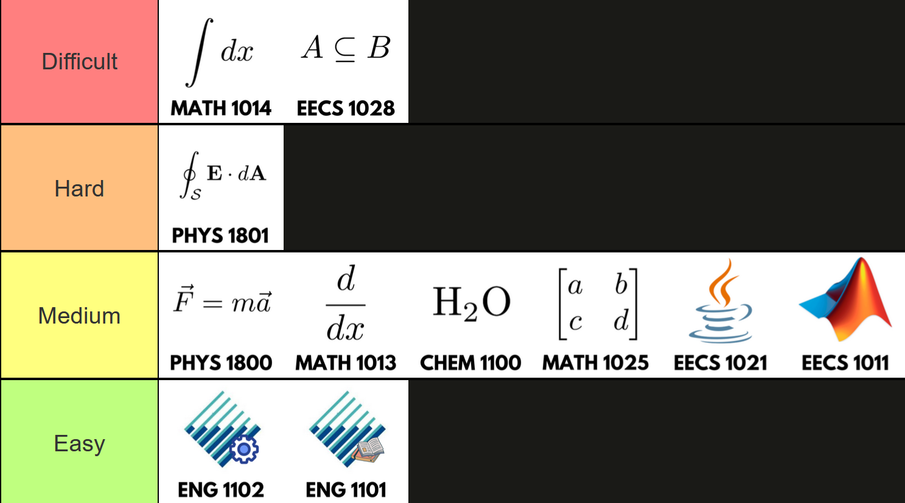

# First Year 
Your first year will contain core classes that you will have to take to satisfy pre-requisites for second year courses. Notice how there is no F tier? That is because again, many your first year classes will be needed as prerequisites to upper year classes. Moreover, you have already have some background from high school which lightens the difficulty (see [here](http://localhost:3000/york-swe-edge/#course-rating-criteria) for more context).

---

## S-Tier

### EECS 1021: OOP from Sensors to Actuators in Java
This is the same premise as EECS 1011, but you will be learning and using the Java programming language along with OOP (Object-Oriented Programming) principles, so take this course religiously.  

Know the Java syntax and OOP well, it will come in handy for future programming and EECS courses. Java may be a bit difficult to get used to coming from only knowing MATLAB or a dynamically typed language like Python. 

---

## A-Tier

### EECS 1011: Computational Thinking Through Mechatronics with MATLAB 
This will be your first programming class in engineering, with a C-like programming language used by scientists and engineers called MATLAB (short for Matrix Laboratory). MATLAB is also used for machine learning applications, like Python, and can be powerful, however, it costs money. MATLAB is also used for engineering jobs for simulation and testing.  

This course also assumes you never programmed before. You may be asked to buy an Arduino Grove kit (for ~$100) for the final project at the end of the course. You may rarely or never MATLAB in upper year courses however. Although, depending on the professor, you may use MATLAB again in future courses like EECS 3451 (Signals & Systems) for signal processing.  

If you've never coded before, I would advise you to learn the coding fundamentals like variables, scoping, loops, and more for future classes. I made my first [personal project](https://github.com/hxddad/arduinovid19-assessment) with the board using MATLAB (and Java [EECS 1021](/courses/1st-year#eecs-1021)). 

### MATH 1013: Applied Calculus 1
 MATH 1013 touches on differential calculus. If you came from an Ontario highschool, then you've probably taken MCV4U (Grade 12 Calculus & Vectors). If so, it's essentially review from high school calculus, though you may stumble upon new concepts. However. if you've taken AP or IB calculus, the course shouldn't be too difficult. 

### MATH 1025: Applied Linear Algebra
You will learn about and apply linear algebra concepts such as matrices, vectors, linear transformations, eigenvalues, eigenvectors, etc. Once again, if you've taken Calculus & Vectors (MCV4U) from an Ontario highschool, it should give you the upper leg. 

It's a useful course if you want to go into advanced and niche fields like machine learning, computer vision, quantum computing, etc. Even if you don't, I do think it's worth learning, which gives you a different perspective at how you look at math.

### ENG 1101: Ethics, Communication & Problem Solving
This will be your first ever ENG course, which will cover (obviously as the course title says) engineering ethics and case studies, communication, and problem-solving. This is an easy and straightforward class, so I recommend trying for an A or A+ to boost your GPA in your first year. I think it's good at introducing people to the world of engineering and has some valuable lessons to take away in the class.

---

## B-Tier

### EECS 1028: Discrete Mathematics for Engineers 
Let me introduce you to the most infamous course for every first-year EECS engineering student. The primary reason this is difficult is that it's different from the computational or mindless plug-n-chug classes you've been doing previously.  

It is about mathematical logic and writing proofs, which most students struggle. Try to get a decent professor, work with a group of friends, understand the concepts, and practice, practice, practice to succeed.  

Ideally, try to get this course done before you start your 2nd year. I dropped it in my 2nd semester in the first year but then I retook it with a different professor in the summer and got a decent grade without tanking my EECS GPA.  It's also a crucial course that requires you to write proofs and know logic for useful courses like EECS 2101 (Data Structures), which unlocks many upper-year courses and preparation for coding interviews.  

Another reason why it's hard is that you may be required to learn exclusive concepts taught from course notes that have unavailable online resources for self-learning. However, I took the class in the summer where we used a mainstream discrete mathematics textbook instead of foreign course notes.  

### MATH 1014: Applied Calculus 2
MATH 1014 is a big jump from MATH 1013, especially if you've never done integral calculus in high school. However, this is the most interesting calculus course in my opinion. You will expand through integral calculus with integration techniques, improper integrals, sequences and series, and power series. Practice problems and master course concepts to do well, which is also applicable to MATH 1013.

Even though you probably won't use calculus on the job, you'll need to understand calculus for upper year classes like PHYS 2020, which heavily uses calculus. Plus as an engineering student, I think it's good to understand calculus (every engineering student swims through calculus). There are some computing fields like machine learning that requires an understanding of calculus and math overall.

### PHYS 1801: Electricity, Magnetism and Optics 
Just as the course title says, you will learn about E&M and optics. This is the most crucial physics course for EECS Engineering students, as you'll take future courses such as electrical circuits, digital logic design, etc.  

You will also be mostly using the breadboard with software such as LabVIEW in the labs. I never used a breadboard before this course, so it was a bit tricky for me to use it. Ask your TAs for help if your circuit isn't working the way it's supposed to after tinkering with it for a while, so you don't burn time during your lab.  

Comparing the course content with PHYS 1800, I found this more interesting.  

---

## C-Tier

### PHYS 1800: Engineering Mechanics 

This first physics course you will be taking may mostly be a review of high school physics since it mostly covers mechanics (kinematics, force, energy, etc.). These topics are important for mechanical, civil, and space engineers. Otherwise, this will be the last time you'll see mechanics in your degree.

You will also have a laboratory component where you will work on experiments related to course content. Treat labs as free marks and work together in a group to boost your grade. 

### ENG 1102: Engineering Design Principles 
This ENG course will be your first design course. Just as the course title says, you'll be taught about engineering designs for solving problems through drawings, frameworks, models, aesthetics, etc. This class is handy if you're in mechanical or civil engineering. You get to work on a project using 3D modeling software like Fusion 360 (and possibly 3D printing them). But honestly, it felt like I'm was just learning filler just to get my credit.  

You may also be placed in a group to propose an engineering design as a potential solution for a current world or local problem. Make sure you are focusing on a design for a technical problem, rather than a social problem. Just like ENG 1101, straightforward class.  

---
## D-Tier

### CHEM 1100: Chemistry & Materials Science   
This is your first (and probably last) chemistry course. I mostly found this course to be easier than my grade 12 chemistry class, partly due to having no organic chemistry. This course requires practice and memorization to do well.  

You will also do chemistry lab experiments involving titration, polymers, analyzing equilibriums and chemical reactions, ferrofluids, and more. The labs will take up time to do (they are 3h long).

The nice thing about this course is that you can take it anytime since it's not a prerequisite for any mandatory future courses. The only thing you need this class for is if you want to take CHEM classes for you science credits in your third year (which can be easily avoided).

If you are looking to do a lighter course load in your second semester of your first year, CHEM 1100 is your pick to opt-out for now. Though, it would be nice to get over it as soon as you can since it may not be offered every semester.  

