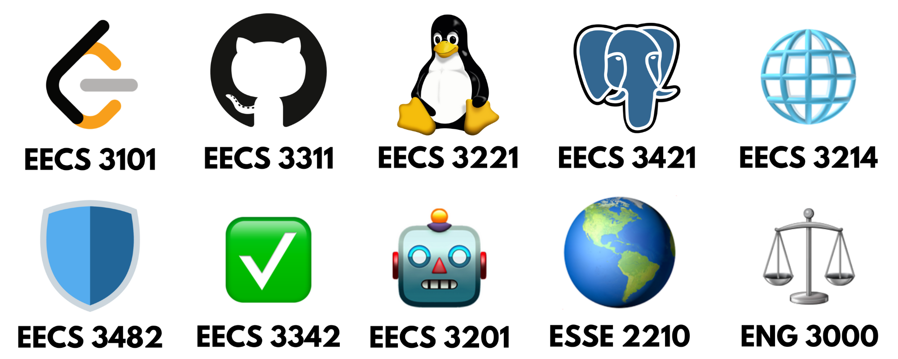

# 3rd Year 

As usual, this tier list assumes you passed all classes and applying the knowledge you learned from your 2nd year. Note at this point you will chose your [SWE Stream](https://hxddad.github.io/york-swe-edge/faq#what-swe-stream-should-i-do), I will be discussing the **Security Stream** courses here since I chose it: EECS 3482 and EECS 3214. 

---
## 😎 S-Tier

### EECS 3311 - Software Design
This course is all about software design ensuring organized code. You'll learn about software design patterns, documentation, best practices, etc. You may also be assigned a project to do with a group. 

We had do implement a parking booking system at York University with given requirements and constraints. I was however fairly disappointed that we had to use Java Swing (that can only be run in the editor) and use a CSV as a database. This isn't optimal as a project to put on a resume, companies value more modern tools being used in the industry. If you can, I recommend recreating the project with moderns tools as a project.

**Depends on your group, but generally:**

> 🟡 Difficulty: 6/10  🚀 Usefulness: 10/10

---
## 🙂 A-Tier

### EECS 3214 - Computer Network Protocols & Applications
EECS 3214 is a deeper dive into computer networks and how the Internet communicate with each other. Even as a developer, it's important to understand how these things work when working with the web, at least on the surface level. This is one of the few courses I'd recommend every computing student to take.

> 🔥 Difficulty: 7/10  🎯 Usefulness: 7/10

### EECS 3482 - Introduction To Computer Security
This course is essentially a brief intro to computer security. It is mostly a conceptual course, where the tests don't require critical thinking, it's simply memorization and understanding of the topics. There are also labs for this course where you'll use relevant computer security tools, which were quite interesting to do. You'll be doing labs such as malware detection, penetration testing, etc.

> 🟡 Difficulty: 6/10  🎯 Usefulness: 7/10

### ESSE 2210 - Engineering & The Environment

Nope, not EECS, it's ESSE (Earth and Space Science and Engineering). This course involves looking at environmental issues and advances such as climate change, global warming, pollution, green energy and technologies, the IPCC, etc. Note that this course may involve essay writing, which may depend on the professor.  

When I took the course, it was fully online, including the tests, so I found it easy (the essays were the annoying part). Course difficulty may depend on the professor, so don't necessarily see this as a free course. I enjoyed learning in this course and I think it has useful things to know in general, so I'd personally give this an A. For instance, there have been advancements of AI data centres, which are harming the environment in several ways (read more here: [AI has an environmental problem. Here’s what the world can do about that](https://www.unep.org/news-and-stories/story/ai-has-environmental-problem-heres-what-world-can-do-about)). This is one example in Software / Computer / Electrical Engineering, among with several applications in other engineering disciplines.
> 🟡 Difficulty: 5/10  🧩 Usefulness: 7/10

---

## 🤔 B-Tier

### EECS 3101 - Design & Analysis of Algorithms

EECS 3101 is heavy in theory and uses mathematical proofs. It covers proving loop invariants, complexities, Greedy, Divide-and-Conquer, Minimum Spanning Trees, and Dynamic Programming. These algorithms would mostly be asked in big tech/name company online assignments and interviews. Just as in EECS 2101, LeetCode would help a bunch in grasping these complicated concepts. Again, this course is also about proving algorithms plus writing them, so this is definitely one of the harder courses in the 3rd year.

> 💀 Difficulty: 10/10   🎯 Usefulness: 7/10

### EECS 3221 - Operating Systems
Along with EECS 3101, this is one of the hardest courses in 3rd year, but one of the most useful ones. You probably won't be an OS or Kernal Developer, but some topics such as  CPU scheduling, concurrency, memory management, file systems and what computers are doing with code in general are important to know as a developer. The most common application is resource and performance optimization, where you'll see bottlenecks like why your application is slow, high CPU usage, memory leaks and how your "app works locally but crashes in prod". 
> 💀 Difficulty: 9/10  🎯 Usefulness: 8/10

---
## 😒 C-Tier

### ENG 3000 - Professional Engineering Practice

Out of all of the ENG courses you've taken so far, you should not sleep on this one (aside from ENG 4000). It's the engineering law course you take in engineering. Depending on the instructor, it'll most likely be memorization and conceptual understanding. When I took it, it was 100% tests and exams (no assignments) so I didn't do as good as the other previous ENG courses.  

The purpose of this course is to prepare you for getting your P.Eng license from the PEO (Professional Engineers of Ontario) and learn its requirements to be a member. Moreover, the tests in the course will have the typical questions and tricks, that you will expect in the written exams when attaining a P.Eng. You will also learn about engineering law such as Contract and Tort Law that you will be aware of when working as a professional engineer in the future. 

This course is essential for mostly for Mechanical, Civil and other engineering disciplines where being licensed is essential to advance in your career. However, it's not really the case for Software Engineering, is merely a "nice to have" in most applications. I even noticed a lot of the case studies are mostly related to Mechanical, Civil and Chemical Engineering, not only because they are easier for outsiders to understand, but also relevant in these fields. The only time a P.Eng is needed is if you'll be working with safety-critical systems, which can result in injury or death of people if anything goes wrong under your responsibility. Regardless of usefulness of attaining a license, I think it has valuable things to takeaway from the course relating to law and ethics.

If you're interested, here's a blog discussing on the state of a P.Eng for Software Engineers: [The Case for P.Eng Certification in Software Engineering: A Canadian Perspective](https://manistechmind.com/posts/peng-for-software-engineers) 

> 🟡 Difficulty: 6/10  🎯 Usefulness: 6/10

---

## 😢 D-Tier

### EECS 3201 - Digital Logic Design

You will be using a hardware-description language on an FPGA called Verilog. Assuming you know nothing, you will be using Verilog in the labs and the final project using the DE-10 Lite FPGA, which you can buy for $140 from the bookstore or borrow from the lab monitors (I borrowed an FPGA from an upper-year student who already took this course).  

This was personally one of my least favorite courses because it was pretty boring and I felt like I was taking another useless class for the credit. You will learn how to design digital circuits using concepts from MATH 1028 and EECS 2021, involving Boolean logic, binary numbers, registers, logic gates, etc. Note that this is different (and easier) from the circuits in EECS 2200. However, this is also a heavy course because of the labs + lecture content (consequently being worth 4.0 credits), so keep that in mind.

Like EECS 2021, this is a core class for people who want to go into embedded systems, FPGA development, robotics and other electrical-computing fields; otherwise, it's pretty useless.

> 💀 Difficulty: 9/10  🧩 Usefulness: 4/10

### EECS 3342 - System Specification & Refinement

This class is about taking problems and solving in using refinements in discrete mathematics. It's a unique way of thinking and solving problems, especially in programming. Here is an oversimplified example: suppose you are building a subway system from point A to B. Your very first, abstract refinement (in the simplest form) would just be a direct trip in a line to point A to B. In the next, concrete refinement, you now take into account stops at stations between A and B. You are making the problem slowly more complex in each refinement, instead placing every factor into a single solution. In a third refinement, you now recognize track signals of when the subway stops or goes. You will eventually reach a fully functional subway system in more refinements.

There will also be programming in the course, adding into the difficulty. You will be using Rodin Event-B to model mathematical solutions. You most likely will never use Rodin in your job. In fact, it's used in very few [industrial and research projects](https://wiki.event-b.org/index.php/Industrial_Projects) revolving around safety-critical systems.

I found this course interesting, but still challenging regardless. You'll also need it when you take EECS 4315 (Mission-Critical Systems), which is essentially a sequel of EECS 3342, which is why I placed it in D-tier. If you'd like to check out the course content, here's a [public resource](https://www.eecs.yorku.ca/~wangcw/teaching/lectures/#EECS3342_F25) too look at created by a professor who teaches the course. Here is also a note from the same professor addressing concerns and FAQ about the course: [EECS3342 (System Specification & Refinement) What It’s Really For: A Note from Your Instructor](https://www.eecs.yorku.ca/~wangcw/teaching/lectures/2025/F/EECS3342/notes/EECS3342-F25-Q&A.pdf)

> 💀 Difficulty: 9/10  🧩 Usefulness: 5/10