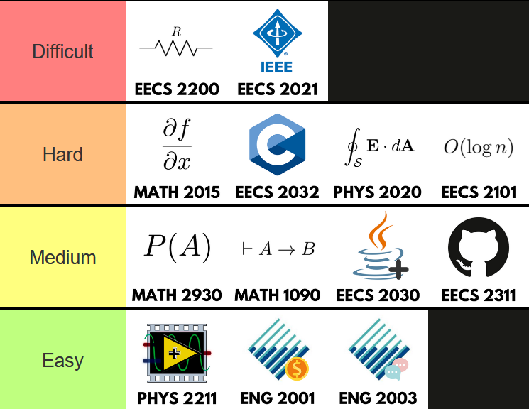

# 3rd Year 

As usual, this tier list assumes you passed all classes and applying the knowledge you learned from third year.

---
## S-Tier

---
## A-Tier
## ESSE 2210 - Engineering & the Environment

Nope, not EECS, it's ESSE (Earth and Space Science and Engineering). This course involves looking at environmental issues and advances such as climate change, global warming, pollution, green energy and technologies, the IPCC, etc. Note that this course may involve essay writing, which may depend on the professor.  

When I took the course, it was fully online, including the tests, so I found it easy (the essays were the annoying part). Course difficulty may depend on the professor, so don't necessarily see this as a free course.

---

## B-Tier
### EECS 3101 - Design and Analysis of Algorithms

EECS 3101 is heavy in theory and uses mathematical proofs. It covers proving loop invariants, complexities, Greedy, Divide-and-Conquer, Minimum Spanning Trees, and Dynamic Programming. These algorithms would mostly be asked in big tech/name company online assignments and interviews. Just as in EECS 2101, LeetCode would help a bunch in grasping these complicated concepts. Again, this course is also about proving algorithms plus writing them, so this is definitely one of the harder courses in the 3rd year.

---
## C-Tier

---

## D-Tier

## EECS 3201 - Digital Logic Design

Remember how I said you'd need Verilog again from EECS 2021? This course is one of them. Though once again, they'll assume you know nothing. You will be using Verilog in the labs and the final project using the DE-10 Lite FPGA, which you can buy for $140 from the bookstore or borrow from the lab monitors (I borrowed an FPGA from an upper-year student who already took this course).  

This was personally one of my least favorite courses because it was pretty boring and I felt like I was taking another useless class for the credit. You will learn how to design digital circuits using concepts from MATH 1028 and EECS 2021, involving Boolean logic, binary numbers, registers, logic gates, etc. Note that this is different (and easier) from the circuits in EECS 2200. However, this is also a heavy course because of the labs + lecture content (consequently being worth 4.0 credits), so keep that in mind.

Like EECS 2021, this is a core class for people who want to go into embedded systems, FPGA development, robotics and other electrical-computing fields; otherwise, it's pretty useless.

---

## F-Tier

<!-- # Third year
Note this page is still unfinished! As of April 2025, I'm currently taking my 3rd year classes for the winter semester. Below are some 3rd year courses I finished in the past.

---

## EECS 3101 - Design and Analysis of Algorithms

EECS 3101 is heavy in theory and uses mathematical proofs. It covers proving loop invariants, complexities, Greedy, Divide-and-Conquer, Minimum Spanning Trees, and Dynamic Programming. These algorithms would mostly be asked in big tech/name company online assignments and interviews. Just as in EECS 2101, LeetCode would help a bunch in grasping these complicated concepts. Again, this course is also about proving algorithms plus writing them, so this is definitely one of the harder courses in the 3rd year.

## EECS 3201 - Digital Logic Design

Remember how I said you'd need Verilog again from EECS 2021? This course is one of them. Though once again, they'll assume you know nothing. You will be using Verilog in the labs and the final project using the DE-10 Lite FPGA, which you can buy for $140 from the bookstore or borrow from the lab monitors (I borrowed an FPGA from an upper-year student who already took this course).  

This was personally one of my least favorite courses because it was pretty boring and I felt like I was taking another useless class for the credit. You will learn how to design digital circuits using concepts from MATH 1028 and EECS 2021, involving Boolean logic, binary numbers, registers, logic gates, etc. Note that this is different (and easier) from the circuits in EECS 2200.  

Like EECS 2021, this course is important for people who want to go into embedded systems and FPGA development; otherwise, it's pretty useless.

## ESSE 2210 - Engineering & the Environment

Nope, not EECS, it's ESSE (Earth and Space Science and Engineering). This course involves looking at environmental issues and advances such as climate change, global warming, pollution, green energy and technologies, the IPCC, etc. Note that this course may involve essay writing, which may depend on the professor.  

When I took the course, it was fully online, including the tests, so I found it easy (the essays were the annoying part). Course difficulty may depend on the professor, so don't necessarily see this as a free course.
 -->
